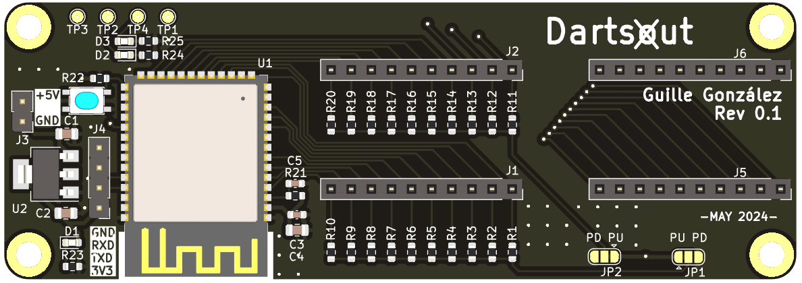

# Dartsout

## Description

Dartsout is a pcb designed to replace the control board of commercial dartboards to make them compatible with Dartsout, a darts playing application hosted on a server.

Firmware used in the microcontroller of this device is [dartsout](https://github.com/GuilleGonzzalez/fw-dartsout), writed in C. Is in charge of reading the value pressed by the dart and sending it via WiFi to the Dartsout server.

## Microprocessor

Espressif [ESP32-S2-SOLO](https://www.espressif.com/en/products/modules) module (NRND).

## Connectors

The device has 10-pin connectors with a pitch of 2.54, compatible with the connectors of commercial targets. For the connection, it will be necessary to unsolder the connectors of the target to be modified and solder them on this PCB.

They have been duplicated to be flexible with the target connectors to be modified, as sometimes they are in parallel and sometimes they are on top of each other.

In all cases, pin 1 is the one on the right.

## Pin assignment

| PIN     | Func       |
| ------- | ---------- |
| GPIO1   | ROW01      |
| GPIO9   | ROW02      |
| GPIO3   | ROW03      |
| GPIO8   | ROW04      |
| GPIO18  | ROW05      |
| GPIO17  | ROW06      |
| GPIO7   | ROW07      |
| GPIO6   | ROW08      |
| GPIO5   | ROW09      |
| GPIO4   | ROW10      |
| GPIO37  | COL01      |
| GPIO36  | COL02      |
| GPIO35  | COL03      |
| GPIO34  | COL04      |
| GPIO33  | COL05      |
| GPIO21  | COL06      |
| GPIO14  | COL07      |
| GPIO13  | COL08      |
| GPIO12  | COL09      |
| GPIO11  | COL10      |
| GPIO11  | COL10      |
| GPIO1   | USER LED 1 |
| GPIO2   | USER LED 2 |

## LEDs

This PCB has 3 LEDs:

- One power LED, indicating that the device is on.
- Two for user control.

# Changelog

All notable changes to this project will be documented in this section.

The format is based on [Keep a Changelog](https://keepachangelog.com/en/1.0.0/)

## [v0.1.0] - 2024-04-26
### Add
First Dartsout version.

## [unreleased] - 2024-04-24

[unreleased]: https://github.com/GuilleGonzzalez/hw-dartsout